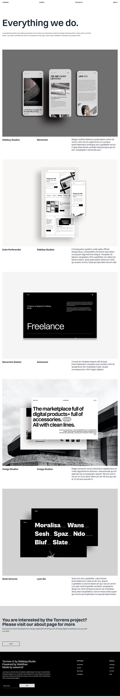
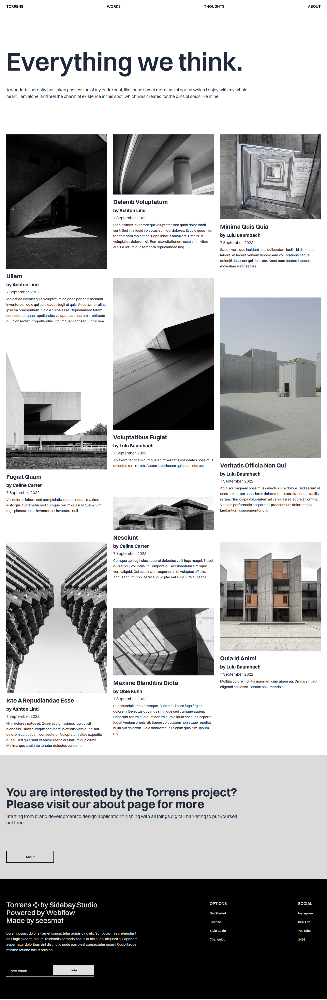

  

<h3 align="center">Torrens</h3>

---

 Torrens Company Website from Webflow
     

## 📝 Table of Contents

- [About](#about)
- [Built Using](#built_using)
- [Authors](#authors)
- [Acknowledgments](#acknowledgement)

## 🧐 About 

Torrens website made from a template taken from Webflow. Pretty basic, but neat looking, made using TailwindCSS mainly.

## 🚀 Deployment 

- [Live View](https://seesmof.github.io/torrens/)

---

---

---

## ⛏️ Built Using 

- [HTML](https://www.w3.org/html/) - Markup Language
- [CSS](https://www.w3schools.com/css/) - Styling Language
- [SASS](https://sass-lang.com/) - CSS Pre-Processor
- [TailwindCSS](https://tailwindcss.com/) - CSS Framework

## ✍️ Authors 

- [@seesmof](https://github.com/seesmof) - Development
- [@Webflow](https://webflow.com/templates/free-website-templates) - Idea & Desing

## 🎉 Acknowledgements 

- [@Webflow](https://webflow.com/templates/free-website-templates) for great website templates
